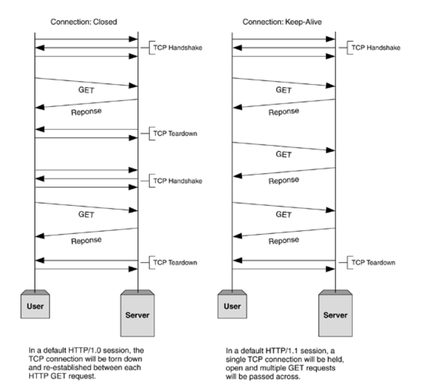
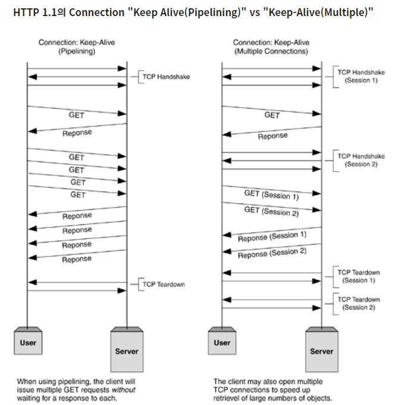
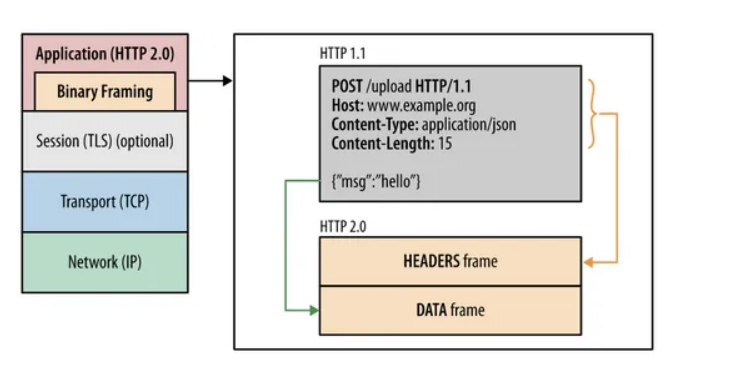
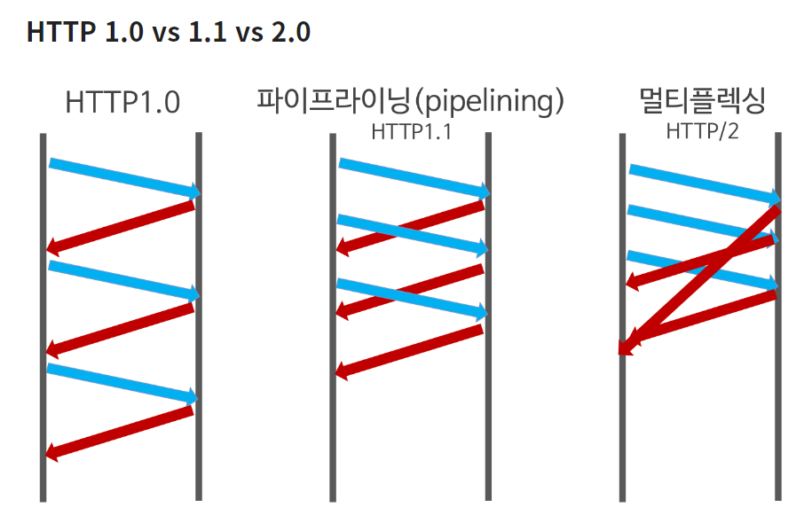
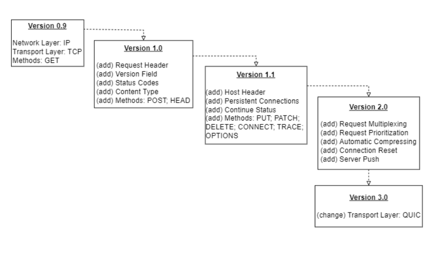

# 2022-08-31 수요일

----

# 주제 web & HTTP 

- HTTP,(1.0 ,1.1, 2.0)비교 

## HTTP 란?

프로토콜이란 상호 간에 정의한 규칙을 의미하며 특정 기기 간에 데이터를 주고받기 위해 정의되있는 규약.

웹에서는 브라우저와 서버 간에 데이터를 주고받기 위한 방식으로 HTTP 프로토콜을 사용하고 있다.

HTTP 프로토콜의 특징

상태가 없는(stateless) 프로토콜

=> 데이터를 주고받기 위한 각각의 요청이 서로 독립적으로 관리된다. 
EX) 이전 데이터 요청과 다음 데이터 요청이 서로 관련없다.

서버는 세션과 같은 추가 정보를 관리할 필요가 없으며, 요청 처리 및 서버의 부하를 줄일수 있는 성능상 이점이 생긴다.

HTTP 프로토콜은 일반적으로 TCP/IP 통신 위에서 동작하며 기본 포트는 80번이다.

## HTTP 1.0

- 브라우저 친화적인 프로토콜
- 요청 및 응답에 대한 메타 데이터를 포함하는 헤더 필드 제공(Status code, Content-Type 등)
- Response: Content-Type에 Http 파일 외에도 스크립트, 스타일 시트, 미디어 등을 전송 가능
- Method: GET, HEAD, POST
- Connection 특성: 응답 직후 종료

## HTTP 1.1 

- 오늘날 가장 많이 사용되는 HTTP 버전
- 영구 및 파이프 라인 연결, 압축/압축 해제, 가상 호스팅, 캐시 등이 추가되어 응답속도가 빨라지고 대역폭이 절약되는 등 
성능 최적화 및 기능 향상 Upgrade로 WebSocket 전환 가능
- Method: GET, HEAD, POST, PUT, DELETE, TRACE, OPTIONS
- Connection 특성: long-lived
- HTTP1.1은 여러 Request-Response에 대해 동일한 연결을 재사용할 수 있다.

- HTTP 1.0: TCP Connection은 HTTP 요청마다 3-way Handshake와 TearDown을 반복한다.
- HTTP 1.1: 하나의 TCP Connection이 열려있으면 (Established 상태), 그 연결을 통해 여러 Request에 대한 Response를 받을 수 있다.

- HTTP 1.1 Keep-Alive Pipelining: Pipelining을 사용할 때, client는 여러 request를 response의 응답을 기다리지 않고 보낼 수 있다.
- HTTP 1.1 Keep-Alive Multiple Connections: 클라이언트는 많은 양의 objects를 검색하는 성능을 높이기 위해 TCP 다중 연결을 할 수 있다.

HOLB(Head Of Line Blocking) - 특정 응답 지연

- Http Pipelining으로 하나의 connection을 통해 다수개의 파일을 Request/Response 받을 수 있지만  
첫 번째 Response가 지연되면, 다음 두, 세번째 Response는 첫번째 응답처리가 완료되기 전까지 대기
==>  Head Of Line Blocking(HOLB)가 발생

## HTTP 2.0

- Stream: 구성된 연결 내에서 전달되는 바이트의 양방향 흐름, 하나 이상의 메시지가 전달 가능하다.
- Message: 논리적 요청 또는 응답 메시지에 매핑되는 프레임의 전체 시퀀스이다.
- Frame: Http/2.0에서 통신의 최소 단위, 각 최소 단위에는 하나의 프라임 헤더가 포함된다.  
이 프라임 헤더는 최소한으로 프레임이 속하는 스트림을 식별한다.  
Headers Type Frame, Data Type Frame이 존재한다.

## HTTP 3.0

이전 HTTP 버전과 다른 초안으로 2020년에 출판 

사용되는 전송 계층 프로토콜이 다르다.
==> QUIC를 통해 설계되었다. 

기본 다중화 및 내장 암호화가 있는 전송계층 프로토콜이다. 
QUIC는 손실 및 느린 연결 대기시간 문제를 완화시키며, 빠른 핸드셰이크 프로세스를 제공한다.

## 참고 

https://hirlawldo.tistory.com/106

https://www.baeldung.com/cs/http-versions